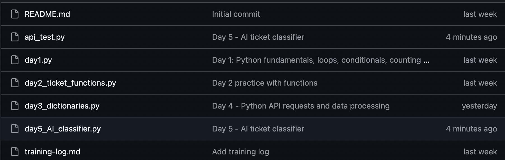

# AI Support Ticket Dashboard

> An AI-powered triage and response tool for support teams — built to reduce manual workload, catch SLA breaches before they escalate, and get draft responses in front of agents faster.



---

## The Problem

Support teams handling high ticket volumes run into the same issues repeatedly:

- Tickets pile up with no clear priority order — agents work on what they see first, not what matters most
- SLA breaches get caught in end-of-day manual audits, hours after the deadline has already passed
- Agents write responses from scratch for tickets that follow the same patterns every day
- There's no live visibility into what categories of issues are spiking

The result is slower resolution times, inconsistent customer communication, and a team that's always reacting rather than managing.

---

## The Solution

This tool runs an AI classification pipeline on incoming support tickets and surfaces the results in a live dashboard built for operational decision-making — not just reporting.

When a ticket comes in, the system:
1. Classifies it by category (login, payment, refund, other) and assigns a priority
2. Checks whether it has already breached its SLA window — 4 hours for high priority, 24 for medium, 72 for low
3. Flags low-confidence classifications for human review rather than routing them incorrectly
4. Assigns a clear action label to every ticket: `escalate_now`, `review_now`, `follow_up_soon`, `monitor_closely`, or `monitor`

Agents open the dashboard, filter by action or category, and know exactly what needs their attention — without digging through a full queue.

---

## What Makes It Different

**SLA breach detection that acts on priority, not just time.** A high-priority ticket that's been open 5 hours is fundamentally different from a low-priority ticket open for the same time. The system treats them differently — high and medium breaches trigger immediate escalation; low-priority breaches surface in monitoring views.

**Confidence-based review queue.** When the AI isn't sure about a classification (below 60% confidence), the ticket goes to a separate review queue instead of being routed automatically. This means bad classifications don't silently reach customers.

**AI draft responses, on demand.** Select any ticket in the dashboard and generate a professional draft response in one click. The response stays cached against that ticket ID for the session — switching tickets and coming back doesn't wipe it. Agents can regenerate if needed.

**Red row highlighting for breached tickets.** Breached tickets are visually distinct in the filtered table — a support manager scanning the dashboard can see where the fires are without reading every row.

---

## Architecture

```
tickets.json → main classification script → classified_tickets.json → Streamlit dashboard
```

- **Python** — ticket loading, classification pipeline, SLA logic, action queue
- **OpenAI API (gpt-4.1-mini)** — ticket classification and draft response generation
- **Pandas** — data handling and filtered views
- **Streamlit** — interactive dashboard with sidebar filters, metrics, and detail view

---

## Business Impact

Support teams using this kind of tooling typically see:

- Faster triage — agents work from an action queue instead of an unsorted inbox
- Fewer missed SLAs — breach detection flags tickets before the end-of-day audit, not after
- More consistent customer communication — AI drafts give agents a starting point rather than a blank page
- Better operational visibility — category and action summaries show what's spiking in real time

The escalation logic alone addresses a common failure mode: a high-priority ticket sits unnoticed because the agent working the queue that hour happened to start from the bottom.

---

## How to Run

**1. Clone the repository**
```bash
git clone https://github.com/your-username/ai-ticket-dashboard
cd ai-ticket-dashboard
```

**2. Install dependencies**
```bash
pip install streamlit pandas openai
```

**3. Set your OpenAI API key**
```bash
export OPENAI_API_KEY="your_key_here"
```

**4. Run the classification pipeline** (generates `classified_tickets.json`)
```bash
python main.py
```

**5. Launch the dashboard**
```bash
streamlit run dashboard.py
```

---

## Project Context

Built as part of a structured transition from customer operations to AI/automation engineering. The Ticket Analyzer is designed to reflect how AI tooling actually gets used in support environments — not as a replacement for agents, but as infrastructure that helps them work on the right things at the right time.
